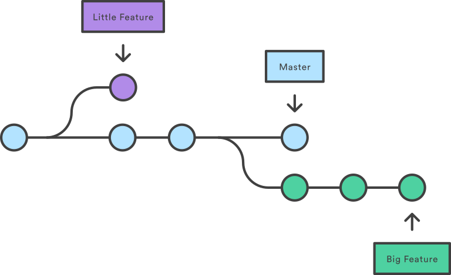

{{ course_summary(title, date, description=description, prev_know=prev_know, skills=skills, mentors=mentors, links=links) }}

## Facts for the session

- The origin of the name "git" was originally a play on the British slang for an unpleasant person. Currently the README on the source code has the following:

"git" can mean anything, depending on your mood.

- random three-letter combination that is pronounceable, and not actually used by any common UNIX command. The fact that it is a mispronunciation of "get" may or may not be relevant.
- stupid. contemptible and despicable. simple. Take your pick from the dictionary of slang.
- "global information tracker": you're in a good mood, and it actually works for you. Angels sing, and a light suddenly fills the room.
- "goddamn idiotic truckload of sh*t": when it breaks

## What is source control?

Imaging you're creating a powerpoint presentation or a word document that you want to present to a client. If you're working on it with multiple people then you'll likely have multiple versions of the file stored in different locations that signify different stages of completion: draft, v1, revised, final, finalfinal, goldv1, honestlyreallyfinal etc. At it's core, this is a very basic version of source control where you're taking a snapshot of the file at a point in time with everyone's contributions compiled together.

As you probably know, this isn't a neat way to approach developing a file as it can quickly become unmanageable as it spirals into many many different versions on people's computers or emailed between people. Developers of this kind of software have moved towards cloud based collaboration platforms like Office365 or Google Workspace which provide a single document that can be continuously built upon with an associated history of changes that can be viewed or reverted back to if required.

When we talk about software source control, we're operating on a similar principle whereby a single code repository (often called a repo for short) becomes the single source of information for a paricular program. The repo is generally stored in a central place that is accessible by developers who can make a local copy of this code and work on it themselves. They're able to make changes or add new features without impacting the source code. When they're finished with the feature, they can merge their changes back into the remote repo which will make their changes availabel to be immediately pulled down by other developers and a full history of the changes to the program is maintained through keeping a log of commits.

## Git

One of the most popular and widespread source control tools is Git which was originally created to support development of the Linux kernel because nothing else available was fit for purpose. When designing git, Linus Torvald, the father of Linux, had a few main design principles:

- It should support a distributed workflow
- It should Include very strong safeguards against corruption, either accidental or malicious

As such, Git allows many developers to work on code simultaneously from anywhere and has strong history and version control aspects to help maintain the integrity of any repo.

If you're working in a linux environment, git can get quickly installed using:

```bash
apt-get install git
```

Below, we'll go through some of the main steps for starting and managing your own git repository via the commandline. Later on we'll cover off how you can manage your repo through other programs (i.e Github, Bitbucket).

## Initialising

To initalise a git repository, you need to navigate to the root directory of either an existing code base that isn't in a repo, or where you plan on developing your code. Once in the root directory, you can run the following command.

```bash
git init
```

This will create a new local git repo that you can start live development and branching from.

## Branching



When a repo is first initialised, a default 'branch' is created (the light blue line in the above  image), generally called main or master, which is the complete source of truth for anyone looking at the code and this will continue as long as the repo is maintained. For larger teams where a pre-prod or development environment is required, often a **develop** branch is created to add another degree of separation and safety between main/production and active development efforts. This also supports robust testing prior to pushing the code live to end users.

If you want to make changes to the source code like fixing a bug, adding a feature or refactoring old code, you can create a new 'branch' off the main development trunk which contains an exact copy of the source code. This allows you to undertake their development work without actually directly interfering with the source code until you're ready to and your changes are accepted by the repository owners/maintainers.

To create a new branch from main, first you check what branch you're on by running the git branch command:

```bash
git branch
# Will return main or master
```

To actually create a new branch, you then need to checkout and at the same time create a new branch in your local repo with:

```bash
git checkout -b feature/branch_name
```

If you want to see all the branches you have stored locally you can run:

```bash
git branch -a
# Should now show main and feature/branch_name as available branches
```

When creating a new branch, it's best practice to name your branch related to what you're working on:

### Feature Branches

Feature branches, denoted by **feature/branch_name**, are for a new feature that might persist across multiple development cycles/deployments depending on the size of the feature. No matter when it get's completed it will be merged back into the main development branch.

### Hotfix Branches

Hotfix branches, denoted by **hotfix/branch_name** are short-lived and used for immediate fixes that need to be merged back into the source code as soon as possible due to critcial issues in production.

### Bug Branches

Bug branches, **bug/branch_name**, are for resolving a bug in the code that doesn't need to be resolved immediately, but will generally be pushed as part of the next deployment if possible.

## Making changes to a branch

As you're developing your code, git will constantly keep track of all your changes when you save your file and how they differ from the code of the branch you're currently on. When you decide you want to lock your changes in and make a permanent change to the branch, there are a few steps you have to follow.

### Staging changes

The first step is to stage your changes for commit which is telling git that you intend to commit and save these changes permanently. You can check what files have been modified by using git status which will return a list of files that are staged for commit, not staged for commit or untracked i.e new.

```bash
git status
```

You can choose to stage everything by running:

```bash
git add .
```
where the . denotes everything. Similarly you can stage individual files by replacing the . with the specific filepath.

```bash
git add src/myproject/myfile.py
```

If you're using VSCode, there is a source control tab on the left panel generally located below the search (magnifying glass) which will show all the changes you've made in a bit of a neater UI. You can also stage files by pressing the + button beside each file which you'll see will move the files from *Changes* to *Staged Changes*.

### Committing changes

When you've staged all the files you intend to commit, you have to add a commit message prior to actually committing them. The commit message should be a descriptive summary of the changes you've made so if someone else wants to check, they can quickly and easily understand what you did. The only time when you can get away with not having a detailed commit message is when you're either merging in changes from the main branch, *"Merged develop into branch"* or initialising a git repo *"Initial commit"*. The code to commit your changes and write a commit message is:

```bash
git commit -m "Write your commit message here in as much detail and specifics as you can"
```

If you're using VSCode, when your files are staged for commit you can write your commit message at the top of the source control tab and press ctrl+Enter to commit the changes to your current branch.

### Pushing your changes

So far everything we've done has been focused on working locally and hasn't touched on developing using a remote respository. So the changes you've made are now committed to your local branch on a commit with a unique ID that can be searched/returned to a later date. However, if you're working on a git repo that is stored somewhere else (Github, Bitbucket etc.) then you need to push your committed changes up to the remote branch so they're captured and stored. To do this you can simply run:

```bash
git push
```

This will work if your branch is up to date with the remote and the remote branch exists, storing your changes in a place where other people can access and pull from.

If your remote branch doesn't yet exist, git will prompt to you setup an upstream connection for your branch, i.e make a connection between your local branch and a remote branch. This can be resolved by typing:

```bash
git push --set-upstream origin feature/branch_name
```

In the next section we'll cover off how to pull down changes other people make to the remote and how to raise Pull Requests and undergo code reviews with senior developers.